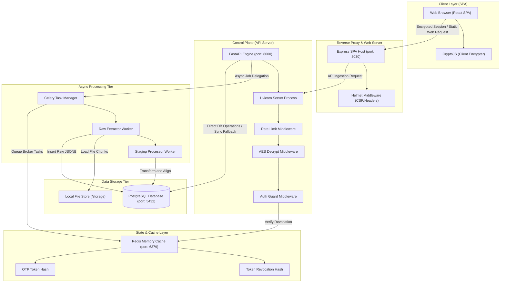
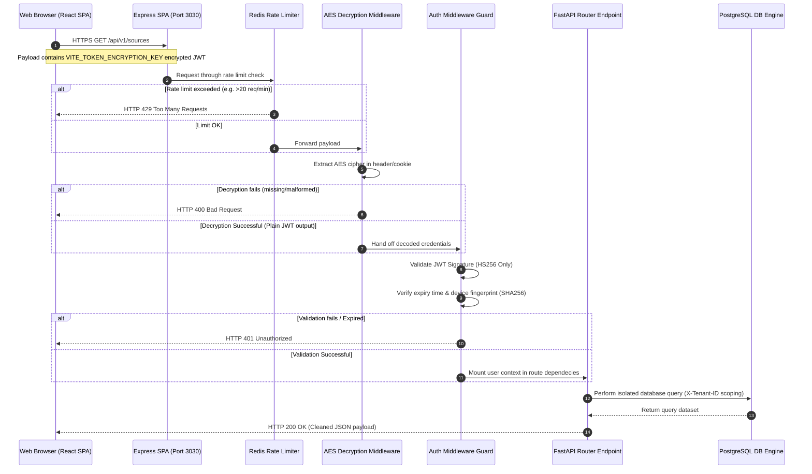
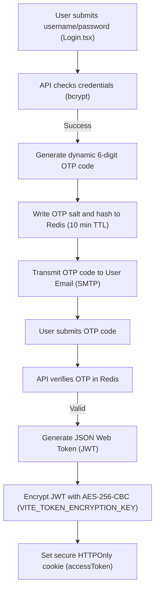
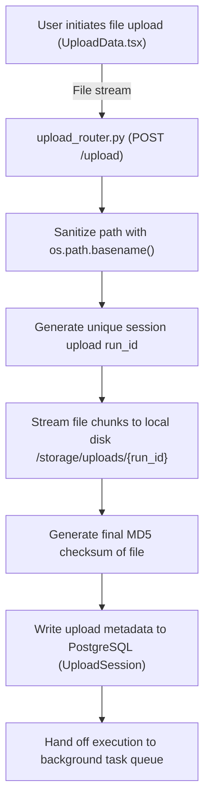
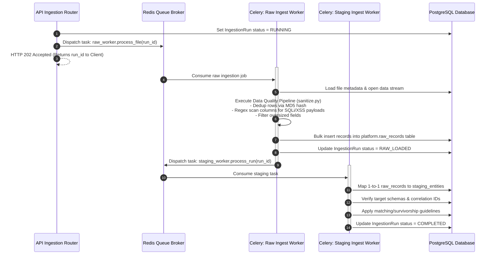
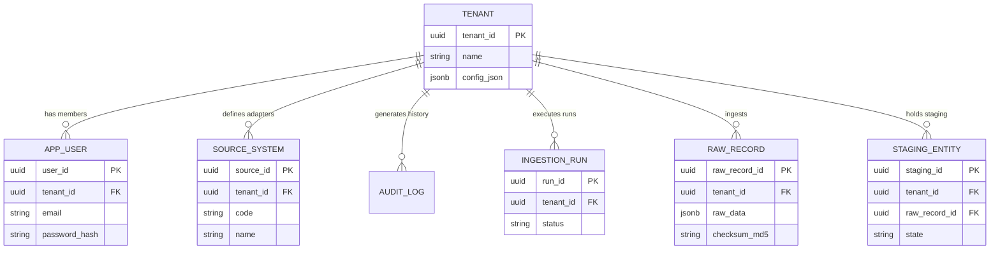
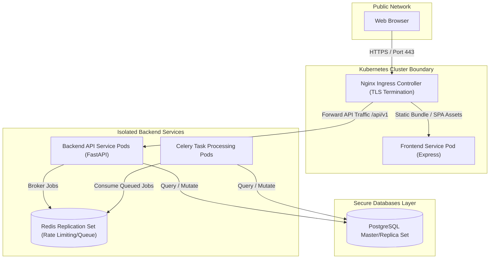

# SignalMDM: Systems & Architectural Specification

This document provides a comprehensive technical overview of the system architecture, logical layers, request pipelines, and background execution topologies of the SignalMDM platform.

---

## 1. System Topology & Logical Architecture

SignalMDM is designed around a decoupled, three-tier enterprise service architecture. The control plane, storage interfaces, task-queues, and caching subsystems operate independently, ensuring horizontal scale and structural high availability.

### 1.1 Architectural Component Topology


---

## 2. Request Lifecycle & Authentication Flows

Every API request entering the SignalMDM boundary is intercepted, audited, decrypted, and evaluated before reaching the route business logic.

### 2.1 The Request Lifecycle Flow


### 2.2 Secure Encrypted Authentication Flow
The security pipeline utilizes client-side encryption to prevent JWT inspection or token interception, combined with multi-factor OTP validation and automated rate limiting.


---

## 3. Data Ingestion & Async Processing Flow

The SignalMDM ingestion engine is an asynchronous state machine managed by Celery. It coordinates file landing-zone persistence, schema integrity validation, deduplication, and staging translation.

### 3.1 Upload Processing Flow


### 3.2 Ingestion & Queue Processing Flow
Once a file is safely landed, the FastAPI control-plane dispatches tasks to the Celery broker (Redis), orchestrating an asynchronous processing pipeline.


---

## 4. Multi-Tenant Isolation Architecture

Logical multi-tenancy is enforced natively in the database schema.

### 4.1 Structural Database Relationship Design
Every entity, source system, mapping config, and transaction log is bound to the root organisation via the `tenant_id` foreign key.


### 4.2 Query-Level Tenant Scoping Pipeline
1.  **Direct Routing Scope:** 
    Standard tenants (`admin`, `data_architect`, `data_manager`) can only query records matching their session context `tenant_id` (extracted from the authenticated JWT payload). The database query layers automatically append `WHERE tenant_id = :session_tenant_id` to all SELECT, UPDATE, and DELETE operations.
2.  **SuperAdmin Scoping Overrides:**
    SuperAdmins belonging to the `"platform"` tenant can override the target tenant context:
    *   The browser app sends a specific header `X-Tenant-ID` containing the target UUID.
    *   The `auth.py` middleware parses this header, validates that the user is a `super_admin`, and mounts the requested `X-Tenant-ID` as the active `tenant_id` parameter inside the request database session context.
3.  **Referential Integrity Safeguard:**
    All database tables declare:
    ```python
    tenant_id = Column(UUID(as_uuid=True), ForeignKey("tenant.tenant_id", ondelete="RESTRICT"), nullable=False)
    ```
    This constraint prevents accidental deletions or cascades from wiping out organizational master data.

---

## 5. Deployment Topology

SignalMDM is deployed as a resilient micro-services cluster managed by Kubernetes.


