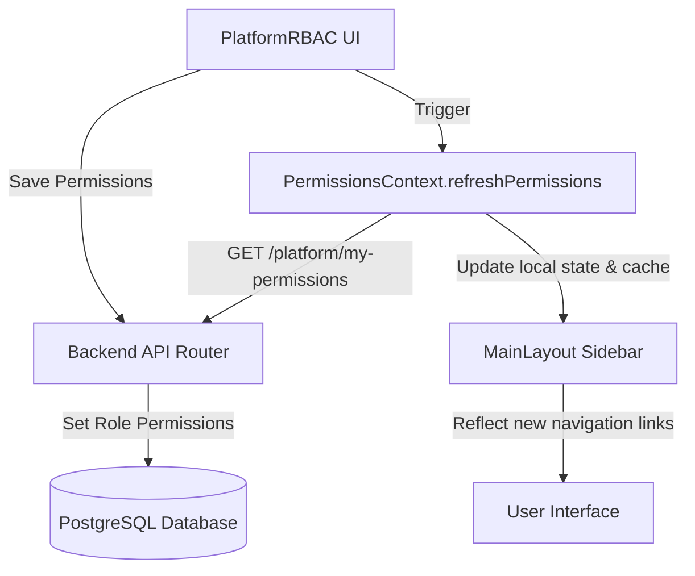

# Platform RBAC & Permissions-Driven Layout Integration

We have successfully completed a fully dynamic, end-to-end **Platform Role-Based Access Control (RBAC)** layout and permission system. The UI navigation now updates **instantly** without requiring a page reload when permissions are changed.

---

## 🏗️ Architecture Overview



### 1. Backend Integration (`platform_rbac_router.py`)
- Introduced a central endpoint: **`GET /api/v1/platform/my-permissions`**
- It resolves the logged-in administrator's active permissions (mapping `screen_key` to a list of permitted `feature_keys`).
- Automatically returns an empty set if the user is tenant-scoped, preserving security isolation.

### 2. Global State & Caching (`PermissionsContext.tsx`)
- Provides a centralized `PermissionsProvider` wrapping the protected application layout.
- Exposes `canAccess(screen: string, feature?: string)` to declaratively verify access at both page level and inline action levels (e.g., hiding a "Delete" button).
- Utilizes `sessionStorage` caching (`perms_v1`) to completely eliminate redundant HTTP roundtrips on layout transitions.
- Exposes a `refreshPermissions()` callback to dynamically bypass the cache and fetch updated access rules directly from the server.

### 3. Immediate UI Re-rendering (`MainLayout.tsx`)
- The navigation structure `NAV` was refactored from hardcoded roles to a dynamic permission schema based on `screen_key` and feature actions (`view`).
- **Sidebar links instantly hide/appear** matching the database configurations the moment they are saved.
- **Route Guarding:** The `platform-rbac` page is securely gated directly inside the react-router tree in `App.tsx`, verifying the `super_admin` role to completely prevent access to unauthorized users.

### 4. Logout Cache Cleanup (`AuthContext.tsx`)
- Integrated session cache eviction into the global `logout` handler.
- Both `evictPermissionsCache()` and `tenantConfigService.clearCache()` are triggered upon logout, guaranteeing that no cached states leak across sessions.

---

## 🛠️ Verification Command

To verify that the frontend builds perfectly with the new TypeScript definitions and imports, run this command in your frontend terminal:

```powershell
npm run build
```
